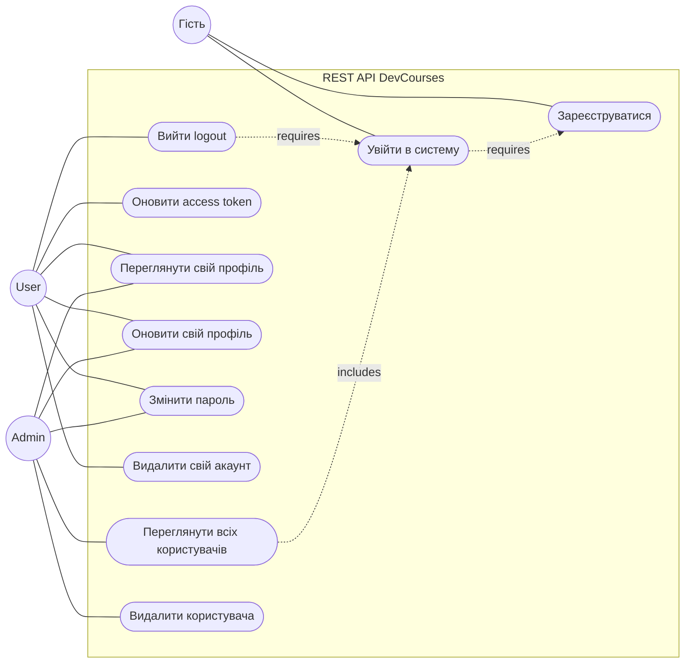
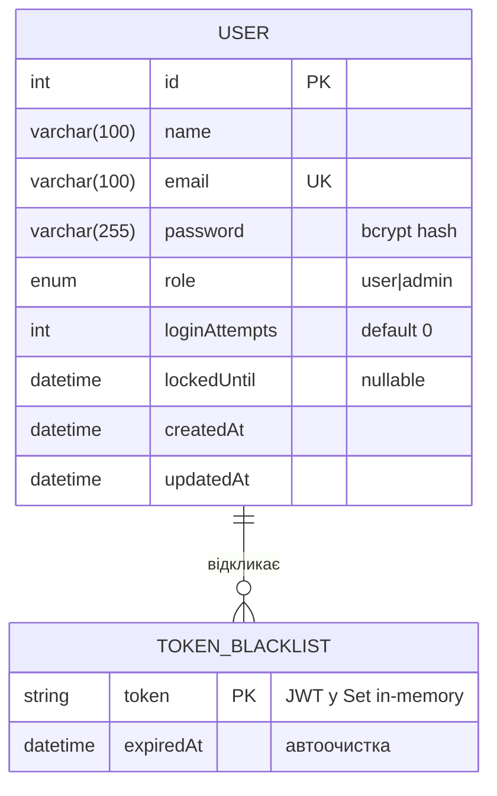
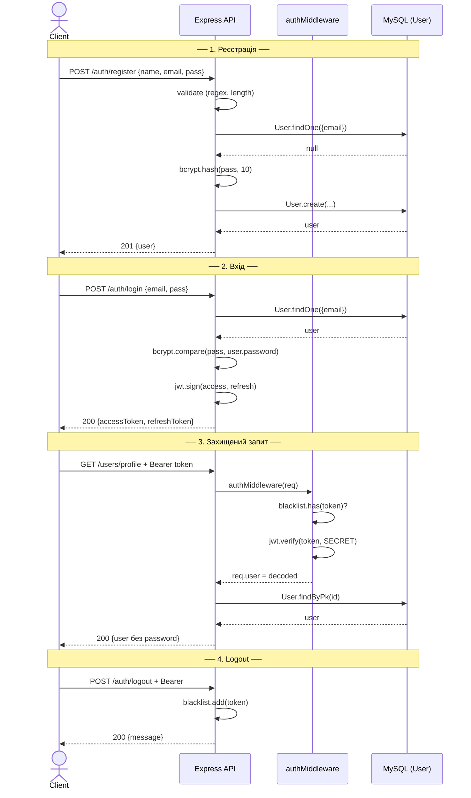
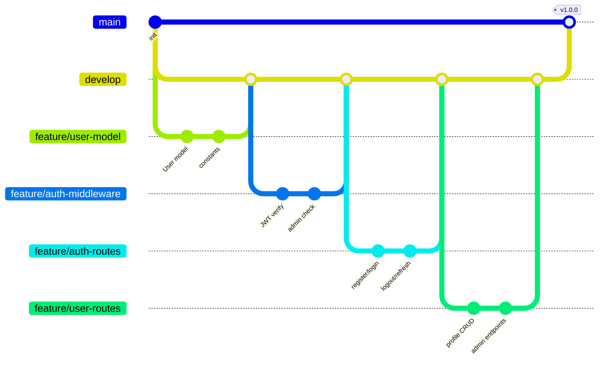

# Лабораторна робота №3

**Тема:** Розробка функціонального REST API. Реєстрація та авторизація користувачів через JWT. Валідація даних і централізована обробка помилок.

**Дисципліна:** WEB-орієнтовані технології. Backend розробки

**Виконав:** студент групи ІО-31 Сас Євгеній Олександрович
**Перевірила:** Світлана Леонідівна Проскура

КПІ ім. Ігоря Сікорського, ФІОТ, кафедра ІСТ — Київ, 2026

---

## Зміст

1. [Мета роботи](#1-мета-роботи)
2. [Опис предметної області та бізнес-логіка](#2-опис-предметної-області-та-бізнес-логіка)
3. [Функціональні вимоги](#3-функціональні-вимоги)
4. [Нефункціональні вимоги](#4-нефункціональні-вимоги)
5. [Use Case діаграма](#5-use-case-діаграма)
6. [ER-діаграма](#6-er-діаграма)
7. [Архітектура застосунку](#7-архітектура-застосунку)
8. [Теоретичні основи: REST, JWT, bcrypt, Middleware](#8-теоретичні-основи-rest-jwt-bcrypt-middleware)
9. [Реалізація: модель, middleware, маршрути](#9-реалізація-модель-middleware-маршрути)
10. [Sequence-діаграма аутентифікації](#10-sequence-діаграма-аутентифікації)
11. [Тестування](#11-тестування)
12. [Версійний контроль Git](#12-версійний-контроль-git)
13. [Висновки](#13-висновки)
14. [Список використаних джерел](#14-список-використаних-джерел)

---

## 1. Мета роботи

Розробити захищений REST API з повноцінною системою аутентифікації та авторизації:

- Реалізувати реєстрацію та вхід користувачів із bcrypt-хешуванням паролів;
- Опанувати JWT-токени (access + refresh strategy);
- Захистити маршрути через middleware із перевіркою токена та ролі;
- Реалізувати **захист від brute-force** атак через лічильник невдалих спроб;
- Налаштувати logout через **token blacklist**;
- Виконати валідацію вхідних даних та централізовану обробку помилок.

---

## 2. Опис предметної області та бізнес-логіка

### 2.1 Контекст

DevCourses — освітня платформа, де користувачі реєструються, переглядають свої курси та керують профілем. Адміністратори мають розширений доступ до даних усіх користувачів. Безпека критично важлива: компрометація паролів може призвести до витоку персональних даних та оплачених курсів.

### 2.2 Актори

| Роль | Опис | Доступ |
|------|------|--------|
| **Гість** | Не авторизований відвідувач | Тільки `/auth/register`, `/auth/login` |
| **User** | Зареєстрований студент | Власний профіль (read/write) |
| **Admin** | Адміністратор системи | Усі профілі + видалення користувачів |

### 2.3 Бізнес-правила

- **БР-1.** Email — унікальний ідентифікатор; неможливо створити два акаунти з однаковим email.
- **БР-2.** Пароль зберігається **тільки** як bcrypt-хеш (cost factor = 10).
- **БР-3.** Мінімальна довжина пароля — 6 символів.
- **БР-4.** Після **5 невдалих спроб** входу акаунт блокується на **15 хвилин** (`lockedUntil`).
- **БР-5.** Access token — короткоживучий (**1 година**), Refresh token — довгий (**7 діб**).
- **БР-6.** Logout додає токен до blacklist (Set у пам'яті) — токен стає невалідним до закінчення TTL.
- **БР-7.** Зміна паролю через `/users/change-password` потребує знання поточного паролю.
- **БР-8.** Видалення власного акаунту — самостійна дія (DELETE /users/profile); видалення чужого — лише адмін.

### 2.4 Бізнес-процеси

**БП-1. Реєстрація**

```
1. Гість надсилає POST /auth/register { name, email, password, confirmPassword }
2. Валідація:
   - Усі поля непорожні
   - Email відповідає regex
   - password.length >= 6
   - password === confirmPassword
   - Email не існує в БД
3. bcrypt.hash(password, 10) → password_hash
4. User.create({ name, email, password: hash, role: 'user' })
5. Відповідь 201: { user: { id, name, email, role } }   ← password НЕ повертається
```

**БП-2. Вхід (з brute-force захистом)**

```
1. POST /auth/login { email, password }
2. User.findOne({ email })
3. Якщо lockedUntil > Date.now() → 423 Locked
4. bcrypt.compare(password, user.password):
   ❌ → loginAttempts++
        Якщо attempts >= 5 → lockedUntil = now + 15min, attempts = 0
        Відповідь 401
   ✅ → loginAttempts = 0, lockedUntil = null
        accessToken = jwt.sign({ id, role }, SECRET, { expiresIn: '1h' })
        refreshToken = jwt.sign({ id }, REFRESH_SECRET, { expiresIn: '7d' })
        Відповідь 200: { accessToken, refreshToken, user }
```

**БП-3. Доступ до захищеного ресурсу**

```
1. GET /users/profile
   Header: Authorization: Bearer <accessToken>
2. authMiddleware:
   - Токен присутній?
   - Не в blacklist?
   - jwt.verify() пройшла?
   - req.user = decoded payload
3. Маршрут отримує req.user.id, повертає профіль
```

---

## 3. Функціональні вимоги

| ID | Назва | Опис | Пріоритет |
|----|-------|------|-----------|
| **FR-001** | Реєстрація | POST /auth/register з валідацією | High |
| **FR-002** | Вхід | POST /auth/login → access + refresh токени | High |
| **FR-003** | Logout | POST /auth/logout → blacklist | High |
| **FR-004** | Refresh | POST /auth/refresh → новий accessToken | High |
| **FR-005** | Перегляд профілю | GET /users/profile (JWT) | High |
| **FR-006** | Оновлення профілю | PUT /users/profile (JWT) | High |
| **FR-007** | Зміна пароля | PUT /users/change-password (JWT + поточний пароль) | High |
| **FR-008** | Видалення власного акаунту | DELETE /users/profile (JWT) | Medium |
| **FR-009** | Список усіх користувачів | GET /users (admin) | Medium |
| **FR-010** | Видалення користувача | DELETE /users/:id (admin) | Medium |
| **FR-011** | Brute-force захист | Блокування на 15 хв після 5 спроб | High |
| **FR-012** | Хешування паролів | bcrypt cost=10 | High |
| **FR-013** | Валідація email | Regex + перевірка на унікальність | High |
| **FR-014** | Перевірка ролі | adminMiddleware для адмінських маршрутів | High |

---

## 4. Нефункціональні вимоги

| ID | Категорія | Вимога |
|----|-----------|--------|
| **NFR-001** | Безпека | bcrypt cost ≥ 10, секрети у env-змінних |
| **NFR-002** | Безпека | Токени підписуються HMAC SHA-256 (HS256) |
| **NFR-003** | Безпека | Захист від SQL-ін'єкцій (Sequelize параметризація) |
| **NFR-004** | Безпека | Захист від brute-force (5 спроб → 15 хв lock) |
| **NFR-005** | Продуктивність | Час входу < 200 мс (включно з bcrypt.compare) |
| **NFR-006** | Підтримуваність | Розділення: routes / middleware / models / config |
| **NFR-007** | Тестованість | Кожен маршрут має HTTP-код для кожного сценарію |
| **NFR-008** | Документованість | README з прикладами curl |

---

## 5. Use Case діаграма



---

## 6. ER-діаграма



> **Примітка:** `TOKEN_BLACKLIST` у поточній реалізації — Set в оперативній пам'яті (`tokenBlacklist = new Set()`). У production потрібен Redis з TTL = JWT expiresIn.

---

## 7. Архітектура застосунку

```mermaid
flowchart TB
    Client[HTTP Client]

    subgraph Server[Express server :3002]
        direction TB

        Routes[Routes Layer]
        AuthRoutes[/auth/*]
        UserRoutes[/users/*]

        MW[Middleware Layer]
        AuthMW[authMiddleware]
        AdminMW[adminMiddleware]

        Models[Sequelize Models]
        UserM[User model]

        Config[Config]
        Const[constants.js<br/>SECRET, blacklist]
    end

    DB[(MySQL)]

    Client -->|HTTP + Bearer| Routes
    Routes --> AuthRoutes
    Routes --> UserRoutes

    AuthRoutes --> Models
    UserRoutes --> MW
    MW --> AuthMW
    MW --> AdminMW
    AuthMW --> Const
    AdminMW --> Const

    UserRoutes --> Models
    Models --> UserM
    UserM --> DB
```

### Структура проєкту

```
lab3/
├── config/
│   ├── database.js          # Sequelize підключення
│   └── constants.js         # SECRET_KEY, REFRESH_SECRET, blacklist Set
├── middleware/
│   └── auth.js              # authMiddleware + adminMiddleware
├── models/
│   └── User.js              # Sequelize модель
├── routes/
│   ├── auth.js              # /register, /login, /logout, /refresh
│   └── users.js             # /profile, /change-password, /users (admin)
├── server.js                # Express app
├── package.json
└── README.md
```

---

## 8. Теоретичні основи: REST, JWT, bcrypt, Middleware

### 8.1 REST принципи

**REST (Representational State Transfer)** — архітектурний стиль:

| Принцип | Пояснення |
|---------|-----------|
| **Stateless** | Сервер не зберігає стан між запитами; клієнт надсилає весь контекст (токен) |
| **Client-Server** | Чітке розділення відповідальностей |
| **Uniform Interface** | Стандартні методи HTTP, ресурси через URL |
| **Cacheable** | Відповіді можуть кешуватися (`Cache-Control`) |
| **Layered System** | Можуть бути проксі/балансувальники між клієнтом і сервером |

### 8.2 JSON Web Token (JWT)

JWT — компактний токен виду `header.payload.signature`:

```
eyJhbGciOiJIUzI1NiJ9          ← Header  (base64)
.eyJzdWIiOiIxIiwicm9sZSI6...  ← Payload (base64) — claims
.dBjftJeZ4CVP-mB92K27uhbUJU1  ← Signature (HMAC-SHA256)
```

**Header:**
```json
{ "alg": "HS256", "typ": "JWT" }
```

**Payload (claims):**
```json
{
  "id": 1,
  "role": "user",
  "iat": 1714492800,    // issued at
  "exp": 1714496400     // expires at
}
```

**Signature:** `HMAC_SHA256(base64(header) + "." + base64(payload), SECRET_KEY)`

**Чому stateless:** сервер не зберігає сесій — достатньо перевірити підпис. Це дозволяє масштабувати API горизонтально.

### 8.3 Стратегія Access + Refresh Token

| Токен | TTL | Призначення | Ризик при витоку |
|-------|-----|-------------|------------------|
| **Access** | 1 година | Доступ до захищених маршрутів | Низький (короткий TTL) |
| **Refresh** | 7 діб | Отримання нового access | Високий (зберігати безпечно) |

**Workflow:**
1. Login → видаються обидва токени
2. Клієнт використовує access для запитів
3. Через годину access закінчується → клієнт надсилає refresh у `/auth/refresh`
4. Сервер перевіряє refresh, видає новий access
5. Користувач не помічає переавторизації

### 8.4 bcrypt — адаптивне хешування

**Чому НЕ MD5/SHA256:**
- Швидкі хеш-функції → атака повним перебором за хвилини на GPU.

**bcrypt:**
- Алгоритм Blowfish, сповільнений штучно.
- **Cost factor** (10 у нашому випадку) = `2^10 = 1024` ітерацій.
- При rounds=10 хешування займає ~100 мс на сучасному CPU.
- Автоматично додає **salt** — однаковий пароль дає різні хеші.

```js
const hash = await bcrypt.hash('password123', 10);
// $2b$10$N9qo8uLOickgx2ZMRZoMyeIjZAgcfl7p92ldGxad68LJZdL17lhWy
//   ^^^  ^^  <----salt(22)----><----hash(31)---->
//   alg cost
```

### 8.5 Middleware у Express

Middleware — функція виду `(req, res, next) => {...}`, що виконується **між** отриманням запиту та відправкою відповіді.

**Конвеєр:**
```
Request → mw1 → mw2 → ... → routeHandler → Response
                            ↑
                  next() передає далі
```

**Наш стек для `/users/profile`:**
```
Request
  → express.json()           ← парсинг тіла
  → authMiddleware           ← перевірка JWT
  → routeHandler /profile    ← бізнес-логіка
  → response
```

Якщо `authMiddleware` не викличе `next()` (наприклад, повернув 401), наступні middleware **не виконуються**.

---

## 9. Реалізація: модель, middleware, маршрути

### 9.1 Модель User (`models/User.js`)

```js
const { DataTypes } = require('sequelize');
const sequelize    = require('../config/database');

const User = sequelize.define('User', {
  name:          { type: DataTypes.STRING(100), allowNull: false },
  email:         { type: DataTypes.STRING(100), allowNull: false, unique: true,
                   validate: { isEmail: true } },
  password:      { type: DataTypes.STRING(255), allowNull: false },
  role:          { type: DataTypes.ENUM('user', 'admin'), defaultValue: 'user' },
  loginAttempts: { type: DataTypes.INTEGER, defaultValue: 0 },
  lockedUntil:   { type: DataTypes.DATE, allowNull: true },
});

module.exports = User;
```

### 9.2 Константи (`config/constants.js`)

```js
module.exports = {
  SECRET_KEY:         process.env.JWT_SECRET   || 'devcourses_secret_2026',
  REFRESH_SECRET:     process.env.JWT_REFRESH  || 'devcourses_refresh_2026',
  ACCESS_EXPIRES_IN:  '1h',
  REFRESH_EXPIRES_IN: '7d',
  MAX_LOGIN_ATTEMPTS: 5,
  LOCK_TIME:          15 * 60 * 1000,    // 15 хвилин
  tokenBlacklist:     new Set(),
};
```

### 9.3 Auth Middleware (`middleware/auth.js`)

```js
const jwt = require('jsonwebtoken');
const { SECRET_KEY, tokenBlacklist } = require('../config/constants');

const authMiddleware = (req, res, next) => {
  const authHeader = req.headers.authorization;
  if (!authHeader?.startsWith('Bearer ')) {
    return res.status(401).json({ error: 'Токен відсутній або має невірний формат' });
  }

  const token = authHeader.slice(7);

  if (tokenBlacklist.has(token)) {
    return res.status(401).json({ error: 'Токен відкликано (logout)' });
  }

  try {
    req.user = jwt.verify(token, SECRET_KEY);
    next();
  } catch (err) {
    if (err.name === 'TokenExpiredError') {
      return res.status(401).json({ error: 'Токен прострочено — використайте /auth/refresh' });
    }
    return res.status(401).json({ error: 'Невалідний токен' });
  }
};

const adminMiddleware = (req, res, next) => {
  if (req.user?.role !== 'admin') {
    return res.status(403).json({ error: 'Доступ заборонено: лише для адміністратора' });
  }
  next();
};

module.exports = { authMiddleware, adminMiddleware };
```

### 9.4 Маршрути аутентифікації (`routes/auth.js`)

```js
const express  = require('express');
const bcrypt   = require('bcryptjs');
const jwt      = require('jsonwebtoken');
const User     = require('../models/User');
const {
  SECRET_KEY, REFRESH_SECRET, ACCESS_EXPIRES_IN, REFRESH_EXPIRES_IN,
  MAX_LOGIN_ATTEMPTS, LOCK_TIME, tokenBlacklist,
} = require('../config/constants');

const router = express.Router();
const emailRegex = /^[\w.+-]+@[\w-]+\.[\w-.]+$/;

// ── РЕЄСТРАЦІЯ ────────────────────────────────────────────────────────
router.post('/register', async (req, res, next) => {
  try {
    const { name, email, password, confirmPassword } = req.body;

    if (!name || !email || !password)
      return res.status(400).json({ error: 'name, email, password — обовʼязкові' });
    if (!emailRegex.test(email))
      return res.status(400).json({ error: 'Некоректний email' });
    if (password.length < 6)
      return res.status(400).json({ error: 'Пароль має містити щонайменше 6 символів' });
    if (password !== confirmPassword)
      return res.status(400).json({ error: 'Паролі не співпадають' });

    if (await User.findOne({ where: { email } }))
      return res.status(409).json({ error: 'Email вже зареєстровано' });

    const hash = await bcrypt.hash(password, 10);
    const user = await User.create({ name, email, password: hash });

    res.status(201).json({
      message: 'Користувача створено',
      user: { id: user.id, name: user.name, email: user.email, role: user.role },
    });
  } catch (err) { next(err); }
});

// ── ВХІД ──────────────────────────────────────────────────────────────
router.post('/login', async (req, res, next) => {
  try {
    const { email, password } = req.body;
    const user = await User.findOne({ where: { email } });
    if (!user) return res.status(401).json({ error: 'Невірний email або пароль' });

    if (user.lockedUntil && user.lockedUntil > new Date())
      return res.status(423).json({
        error: 'Акаунт заблоковано',
        unlocksAt: user.lockedUntil,
      });

    const ok = await bcrypt.compare(password, user.password);
    if (!ok) {
      user.loginAttempts += 1;
      if (user.loginAttempts >= MAX_LOGIN_ATTEMPTS) {
        user.lockedUntil   = new Date(Date.now() + LOCK_TIME);
        user.loginAttempts = 0;
      }
      await user.save();
      return res.status(401).json({ error: 'Невірний email або пароль' });
    }

    user.loginAttempts = 0;
    user.lockedUntil   = null;
    await user.save();

    const accessToken  = jwt.sign({ id: user.id, role: user.role }, SECRET_KEY,
                                  { expiresIn: ACCESS_EXPIRES_IN });
    const refreshToken = jwt.sign({ id: user.id }, REFRESH_SECRET,
                                  { expiresIn: REFRESH_EXPIRES_IN });

    res.json({
      accessToken, refreshToken,
      user: { id: user.id, name: user.name, email: user.email, role: user.role },
    });
  } catch (err) { next(err); }
});

// ── LOGOUT ────────────────────────────────────────────────────────────
router.post('/logout', (req, res) => {
  const token = req.headers.authorization?.slice(7);
  if (token) tokenBlacklist.add(token);
  res.json({ message: 'Вихід виконано' });
});

// ── REFRESH ───────────────────────────────────────────────────────────
router.post('/refresh', (req, res) => {
  const { refreshToken } = req.body;
  if (!refreshToken) return res.status(400).json({ error: 'refreshToken обовʼязковий' });

  try {
    const decoded = jwt.verify(refreshToken, REFRESH_SECRET);
    const accessToken = jwt.sign({ id: decoded.id }, SECRET_KEY,
                                  { expiresIn: ACCESS_EXPIRES_IN });
    res.json({ accessToken });
  } catch {
    res.status(401).json({ error: 'Невалідний або прострочений refreshToken' });
  }
});

module.exports = router;
```

### 9.5 Маршрути користувачів (`routes/users.js`)

```js
const express = require('express');
const bcrypt  = require('bcryptjs');
const User    = require('../models/User');
const { authMiddleware, adminMiddleware } = require('../middleware/auth');

const router = express.Router();

router.get('/profile', authMiddleware, async (req, res) => {
  const user = await User.findByPk(req.user.id, {
    attributes: { exclude: ['password'] },
  });
  res.json(user);
});

router.put('/profile', authMiddleware, async (req, res) => {
  const user = await User.findByPk(req.user.id);
  if (req.body.name) user.name = req.body.name;
  await user.save();
  res.json({ id: user.id, name: user.name, email: user.email });
});

router.put('/change-password', authMiddleware, async (req, res) => {
  const { currentPassword, newPassword } = req.body;
  const user = await User.findByPk(req.user.id);

  if (!await bcrypt.compare(currentPassword, user.password))
    return res.status(401).json({ error: 'Поточний пароль невірний' });
  if (newPassword.length < 6)
    return res.status(400).json({ error: 'Новий пароль занадто короткий' });

  user.password = await bcrypt.hash(newPassword, 10);
  await user.save();
  res.json({ message: 'Пароль змінено' });
});

router.delete('/profile', authMiddleware, async (req, res) => {
  await User.destroy({ where: { id: req.user.id } });
  res.json({ message: 'Акаунт видалено' });
});

router.get('/', authMiddleware, adminMiddleware, async (req, res) => {
  const users = await User.findAll({ attributes: { exclude: ['password'] } });
  res.json({ count: users.length, data: users });
});

router.delete('/:id', authMiddleware, adminMiddleware, async (req, res) => {
  const deleted = await User.destroy({ where: { id: req.params.id } });
  if (!deleted) return res.status(404).json({ error: 'Користувача не знайдено' });
  res.json({ message: 'Користувача видалено' });
});

module.exports = router;
```

---

## 10. Sequence-діаграма аутентифікації



---

## 11. Тестування

### 11.1 HTTP-коди для всіх сценаріїв

| Сценарій | Метод + URL | Код | Тіло |
|----------|-------------|-----|------|
| Успішна реєстрація | POST /auth/register | **201** | `{ user }` |
| Email уже існує | POST /auth/register | **409** | `{ error: "Email вже..." }` |
| Невалідний email | POST /auth/register | **400** | `{ error: "Некоректний email" }` |
| Короткий пароль | POST /auth/register | **400** | `{ error: "Пароль..." }` |
| Успішний вхід | POST /auth/login | **200** | `{ accessToken, refreshToken, user }` |
| Невірний пароль | POST /auth/login | **401** | `{ error: "Невірний email або пароль" }` |
| Акаунт заблоковано | POST /auth/login | **423** | `{ error: "Акаунт заблоковано", unlocksAt }` |
| Профіль без токена | GET /users/profile | **401** | `{ error: "Токен відсутній" }` |
| Прострочений токен | GET /users/profile | **401** | `{ error: "Токен прострочено" }` |
| Не адмін | GET /users | **403** | `{ error: "Доступ заборонено..." }` |

### 11.2 Приклади curl

```bash
# 1. Реєстрація
curl -X POST http://localhost:3002/auth/register \
  -H "Content-Type: application/json" \
  -d '{"name":"Євгеній","email":"sas@kpi.ua","password":"pass123","confirmPassword":"pass123"}'

# 2. Вхід
TOKEN=$(curl -s -X POST http://localhost:3002/auth/login \
  -H "Content-Type: application/json" \
  -d '{"email":"sas@kpi.ua","password":"pass123"}' | jq -r .accessToken)

# 3. Профіль
curl http://localhost:3002/users/profile \
  -H "Authorization: Bearer $TOKEN"

# 4. Зміна пароля
curl -X PUT http://localhost:3002/users/change-password \
  -H "Authorization: Bearer $TOKEN" \
  -H "Content-Type: application/json" \
  -d '{"currentPassword":"pass123","newPassword":"newpass456"}'

# 5. Logout
curl -X POST http://localhost:3002/auth/logout \
  -H "Authorization: Bearer $TOKEN"

# 6. Refresh
curl -X POST http://localhost:3002/auth/refresh \
  -H "Content-Type: application/json" \
  -d '{"refreshToken":"<refresh>"}'
```

### 11.3 Перевірка brute-force захисту

```bash
# 5 разів поспіль із неправильним паролем
for i in {1..5}; do
  curl -X POST http://localhost:3002/auth/login \
    -H "Content-Type: application/json" \
    -d '{"email":"sas@kpi.ua","password":"wrong"}'
done

# 6-та спроба → 423 Locked
curl -X POST http://localhost:3002/auth/login \
  -d '{"email":"sas@kpi.ua","password":"wrong"}'
# → {"error":"Акаунт заблоковано","unlocksAt":"2026-..."}
```

---

## 12. Версійний контроль Git



| Гілка | Призначення |
|-------|-------------|
| `feature/user-model` | Sequelize модель User + constants |
| `feature/auth-middleware` | authMiddleware + adminMiddleware |
| `feature/auth-routes` | /register, /login, /logout, /refresh |
| `feature/user-routes` | /profile, /change-password, /users |

**Репозиторій:** https://github.com/Freazg/devcourses3

---

## 13. Висновки

У результаті виконання лабораторної роботи №3 розроблено захищений REST API DevCourses із повноцінною системою аутентифікації:

1. **Реєстрація** з валідацією: email (regex), пароль (≥6 символів), confirmPassword, унікальність email.
2. **Bcrypt-хешування** паролів із cost=10 (~100 мс на хеш) — захист від атак повного перебору.
3. **JWT токени:** access (1 год) для запитів, refresh (7 днів) для оновлення без переавторизації.
4. **Middleware-архітектура:**
   - `authMiddleware` — перевірка `Authorization: Bearer`, blacklist, jwt.verify();
   - `adminMiddleware` — перевірка ролі `admin` у payload.
5. **Brute-force захист:** лічильник `loginAttempts` + поле `lockedUntil` блокує акаунт на 15 хв після 5 невдалих спроб.
6. **Logout через blacklist:** Set токенів у пам'яті (у production — Redis з TTL).
7. **HTTP-коди коректні:** 200/201/400/401/403/404/409/423.
8. **Захист від SQL-ін'єкцій:** Sequelize параметризовані запити автоматично.
9. **Розділення відповідальностей:** routes / middleware / models / config — чітка SOLID-структура.

Опанована стратегія access+refresh tokens та middleware-архітектура — індустріальний стандарт для будь-якого захищеного REST API.

---

## 14. Список використаних джерел

1. RFC 7519. **JSON Web Token (JWT).** — https://datatracker.ietf.org/doc/html/rfc7519
2. jwt.io. **Introduction to JSON Web Tokens.** — https://jwt.io/introduction
3. npm: jsonwebtoken. — https://www.npmjs.com/package/jsonwebtoken
4. npm: bcryptjs. — https://www.npmjs.com/package/bcryptjs
5. OWASP. **Authentication Cheat Sheet.** — https://cheatsheetseries.owasp.org/cheatsheets/Authentication_Cheat_Sheet.html
6. OWASP. **Password Storage Cheat Sheet.** — https://cheatsheetseries.owasp.org/cheatsheets/Password_Storage_Cheat_Sheet.html
7. Express.js Documentation. **Using middleware.** — https://expressjs.com/en/guide/using-middleware.html
8. Sequelize Documentation. — https://sequelize.org/docs/v6
9. Mermaid.js. **Sequence diagrams.** — https://mermaid.js.org/syntax/sequenceDiagram.html
10. ДСТУ 3008:2015. Документація. Звіти у сфері науки і техніки.
